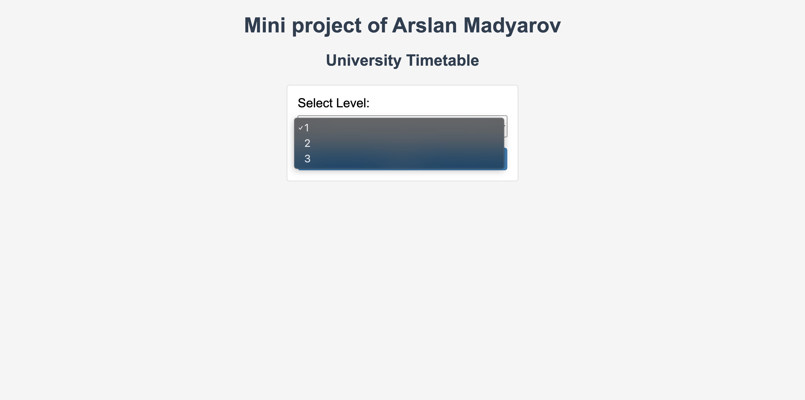
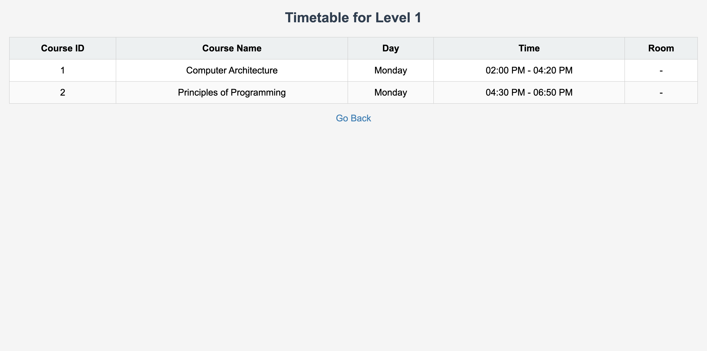

## Project Description

This is a simple web application I made for my final on Operating Systems class at my university. It shows the timetable of courses based on the student's level. I used courses I've taken. The app uses Python and Flask for the web server, and PostgreSQL for the database. It is containerized using Docker.

## Screenshots

### Home page


### Level selection



### Timetable for a level



## Steps I followed during development

### 1. Set Up the Project

- Created a new folder for the project.

### 2. Set Up the PostgreSQL Database with Docker

- Pulled the PostgreSQL image:

  ```bash
  docker pull postgres:latest
  ```

- Created a Docker container for PostgreSQL:

  ```bash
  docker run --name arslan-db \
    -e POSTGRES_USER=student \
    -e POSTGRES_PASSWORD=student_pass \
    -e POSTGRES_DB=Arslan \
    -d -p 5432:5432 postgres:latest
  ```

- Connected to the PostgreSQL database inside the container:

  ```bash
  docker exec -it arslan-db psql -U student -d Arslan
  ```

### 3. Create the Database Tables

- Created the `Timetable` table and inserted courses:

  ```sql
  CREATE TABLE Timetable (
      course_id SERIAL PRIMARY KEY,
      course_name VARCHAR(255),
      day VARCHAR(50),
      time VARCHAR(50),
      room VARCHAR(50),
      level INT
  );

  INSERT INTO Timetable (course_name, day, time, room, level) VALUES
  ('Introduction to Programming', 'Monday', '9:00 AM', 'Room 101', 1),
  ('Data Structures', 'Tuesday', '11:00 AM', 'Room 102', 2),
  ('Databases', 'Wednesday', '2:00 PM', 'Room 103', 2),
  ('Web Development', 'Thursday', '10:00 AM', 'Room 104', 1),
  ('Advanced Algorithms', 'Friday', '1:00 PM', 'Room 105', 3);
  ```

- Created the `Students` table and inserted sample students:

  ```sql
  CREATE TABLE Students (
      student_id SERIAL PRIMARY KEY,
      name VARCHAR(255),
      level INT
  );

  INSERT INTO Students (name, level) VALUES
  ('Alice Johnson', 1),
  ('Bob Smith', 2),
  ('Charlie Brown', 3);
  ```

### 4. Set Up the Python Environment

- Created and activated a virtual environment:

  ```bash
  python -m venv venv
  source venv/bin/activate
  ```

- Installed Flask and pg8000:

  ```bash
  pip install flask pg8000
  ```

### 5. Write the Flask Application

- Created `app.py`:

  ```python
  from flask import Flask, render_template, request
  import pg8000
  import os

  app = Flask(__name__)

  DB_HOST = os.environ.get("DB_HOST", "db")
  DB_NAME = os.environ.get("DB_NAME", "Arslan")
  DB_USER = os.environ.get("DB_USER", "student")
  DB_PASS = os.environ.get("DB_PASS", "student_pass")

  def get_db_connection():
      return pg8000.connect(
          user=DB_USER,
          password=DB_PASS,
          host=DB_HOST,
          port=5432,
          database=DB_NAME,
      )

  @app.route("/", methods=["GET"])
  def index():
      conn = get_db_connection()
      cur = conn.cursor()
      cur.execute("SELECT DISTINCT level FROM Timetable ORDER BY level;")
      levels = cur.fetchall()
      cur.close()
      conn.close()
      return render_template("index.html", levels=levels)

  @app.route("/timetable", methods=["GET"])
  def timetable():
      level = request.args.get("level")
      if not level:
          return "Level not specified", 400
      conn = get_db_connection()
      cur = conn.cursor()
      cur.execute("SELECT course_id, course_name, day, time, room FROM Timetable WHERE level = %s;", (level,))
      rows = cur.fetchall()
      cur.close()
      conn.close()
      message = "No data found for this level." if not rows else None
      return render_template("timetable.html", data=rows, message=message, level=level)

  if __name__ == "__main__":
      app.run(debug=True, host="0.0.0.0")
  ```

### 6. Create the HTML Templates

- Created `templates/index.html`:

  ```html
  <!DOCTYPE html>
  <html>
  	<head>
  		<title>University Timetable</title>
  		<style>
  			/* Some CSS styles for a clean look */
  		</style>
  	</head>
  	<body>
  		<h1>Mini project of Arslan Madyarov</h1>
  		<form method="GET" action="/timetable">
  			<label for="level">Select Level:</label>
  			<select id="level" name="level" required>
  				
  				<option value="{{ level[0] }}">{{ level[0] }}</option>
  				
  			</select>
  			<button type="submit">Submit</button>
  		</form>
  	</body>
  </html>
  ```

- Created `templates/timetable.html`:

  ```html
  <!DOCTYPE html>
  <html>
  	<head>
  		<title>Timetable for Level {{ level }}</title>
  		<style>
  			/* Some CSS styles for a clean look */
  		</style>
  	</head>
  	<body>
  		<h2>Timetable for Level {{ level }}</h2>
  		
  		<table>
  			<tr>
  				<th>Course ID</th>
  				<th>Course Name</th>
  				<th>Day</th>
  				<th>Time</th>
  				<th>Room</th>
  			</tr>
  			
  			<tr>
  				<td>{{ row[0] }}</td>
  				<td>{{ row[1] }}</td>
  				<td>{{ row[2] }}</td>
  				<td>{{ row[3] }}</td>
  				<td>{{ row[4] }}</td>
  			</tr>
  			
  		</table>
  		
  		<p>{{ message }}</p>
  		
  		<a href="/">Go Back</a>
  	</body>
  </html>
  ```

### 7. Test the Application Locally

- Ran the Flask application:

  ```bash
  python app.py
  ```

- Accessed the application at `http://127.0.0.1:5000/`.

### 8. Dockerize the Application

- Created a `Dockerfile`:

  ```dockerfile
  FROM python:3.9-slim
  WORKDIR /app
  COPY requirements.txt .
  RUN pip install -r requirements.txt
  COPY . .
  EXPOSE 5000
  CMD ["python", "app.py"]
  ```

- Created a `requirements.txt`:

  ```bash
  pip freeze > requirements.txt
  ```

- Created a `docker-compose.yml`:

  ```yaml
  version: "3.8"

  services:
    db:
      image: postgres:latest
      container_name: arslan-db
      environment:
        POSTGRES_USER: student
        POSTGRES_PASSWORD: student_pass
        POSTGRES_DB: Arslan
      volumes:
        - db_data:/var/lib/postgresql/data
        - ./db_init:/docker-entrypoint-initdb.d
      ports:
        - "5432:5432"

    web:
      build: .
      container_name: arslan-flask-app
      depends_on:
        - db
      ports:
        - "5000:5000"
      environment:
        - DB_HOST=db
        - DB_NAME=Arslan
        - DB_USER=student
        - DB_PASS=student_pass
      volumes:
        - .:/app

  volumes:
    db_data:
  ```

### 9. Initialize the Database Automatically

- Created a `db_init/init.sql` with the SQL commands to create tables and insert data.

### 10. Run the Application with Docker
- Built and ran the Docker containers:

  ```bash
  docker-compose up --build
  ```

- Accessed the application at `http://localhost:5000/`.

### 11. Use Volume Mounting for Easier Development

- Updated `docker-compose.yml` to include volume mounting for the `web` service so that I dont need to reload the container every time I make a change to the code.

### 12. Push the Project to GitHub

- Initialized a Git repository:

  ```bash
  git init
  git add .
  git commit -m "Initial commit"
  ```

- Created a repository on GitHub and pushed the code.

### 13. Running the Application in the Future

- To run the application after closing Docker and the terminal:

  ```bash
  docker-compose up
  ```

- Accessed the application at `http://localhost:5000/`.
